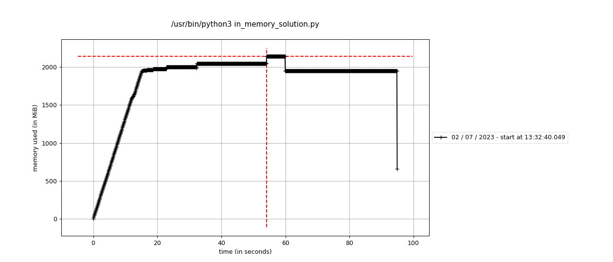

External sorting is a class of sorting algorithms that can handle massive amounts of data. External sorting is required when the data being sorted do not fit into the main memory of a computing device (usually RAM) and instead they must reside in the slower external memory, usually a disk drive. Thus, external sorting algorithms are external memory algorithms and thus applicable in the external memory model of computation.

Problem:

Implement an external sorting algorithm. The input will be a large file of 500MB
containing integers on each line. Assume the system can only handle 100MB of Memory.

Execute the following to generate the large file:
```
python3 gen.py
```

---

Solution:

The in memory solution would load the whole file in memory and sort the data.
However, this would go over the 100MB memory limit.

The idea to solve this is to break the file into chunks of small size (10MB)
for example and sort them in-memory.

Then, we use the algorithm of Merging K Sorted Arrays with a MinHeap
to sort the chunks and write to a result file.

---

What are the time complexities?

Breaking the file into chunks: O(n)
Sorting one chunk: O(n/k * lg (n/k))
Using the minheap to sort and merge the chunks: O(k*lg(k) * n)

Since we are not parallelizing and have to sort each chunk at a time,
we do it N times. Making the time complexity:

Time Complexity: O(n*lg(n))

---

To understand the memory usage, we are going to use [mprof](https://pypi.org/project/memory-profiler/).

Running [in_memory_solution.py](./in_memory_solution.py) with `mprof run in_memory_solution.py`,
we used around 2GB of memory.



Now, running [solution.py](./solution.py) with `mprof run solution.py`,
we used around 60MB of memory.


